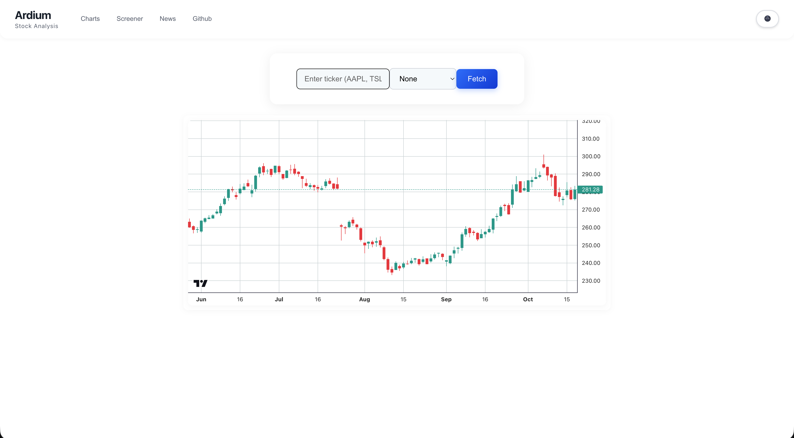

# Ardium? - Advanced Stock Analysis Project

## Project Overview
Hi, my name is Peter and welcome to my project!
I'm a CS major with a strong interest in finance, stocks, and full stack development.
This is sort of a passion project to me, in which I plan to combine both passions: tech & markets. I aim to build a modern, full-stack stock analysis platform built with React, Node.js, and TradingView charts, with later integration with Python and Flask for machine learning models. I want to see how far I can push myself to create this financial application with AI-powered predictions, real-time data, and comprehensive market analysis tools.

## Current Status:
- **Frontend**: React with professional TradingView candlestick charts
- **Backend**: Node.js/Express API serving sample stock data
- **UI/UX**: Clean, minimal navigation with dark/light theme support
- **Architecture**: Component-based structure ready for scaling

---

## Development Roadmap

### **Phase 1: Foundation & Core Features** 

#### **1.1 Complete Basic UI** ◄
- [⚠️] Implement navigation state management (active page tracking)
- [ ] Add click handlers for navigation buttons
- [ ] Create placeholder pages for Screener, News, Watchlist
- [⚠️] Polish existing chart functionality
- [⚠️] Responsive design

#### **1.2 Real Data Integration**
- [✅] Replace mock data with real stock API (Alpha Vantage)
- [✅] Convert backend data format to proper OHLC for TradingView
- [⚠️] Add error handling for API failures
- [✅] Implement data caching to reduce API calls
- [⚠️] Add loading states and spinners
- [⚠️] Add dynamic suggestions in search bar for tickers

#### **1.3 Enhanced Chart Features**
- [ ] Add more technical indicators (RSI, MACD, Bollinger Bands)
- [ ] Implement timeframe selection
- [ ] Add volume chart below price chart
- [ ] Chart zoom and pan functionality
- [ ] Export chart as image feature

---

### **Phase 2: Core Pages & Functionality**

#### **2.1 Stock Screener Page**
- [ ] Build filtering system (price range, volume, market cap, P/E ratio)
- [ ] Add sector/industry filtering
- [ ] Implement sorting functionality (price, change %, volume)
- [ ] Create results table with clickable stocks
- [ ] Add "View Chart" functionality from screener results
- [ ] Save/export screener results

#### **2.2 Market News Page**
- [ ] Integrate financial news API (NewsAPI, Alpha Vantage News)
- [ ] Add news categories (Earnings, Market, Crypto, Sector-specific)
- [ ] Implement news search functionality
- [ ] Add news sentiment indicators
- [ ] Link news articles to relevant stock charts
- [ ] News updates

#### **2.3 Watchlist Page**
- [ ] Implement persistent storage (localStorage initially)
- [ ] Add/remove stocks functionality
- [ ] Real-time price updates for watchlist items
- [ ] Price change alerts/notifications
- [ ] Watchlist organization (folders/categories)
- [ ] Export watchlist functionality

---

### **Phase 3: Advanced Features & Backend Enhancement**

#### **3.1 Portfolio Tracker** ?
- [ ] Add positions tracking (buy/sell transactions)
- [ ] Calculate P&L (profit and loss)
- [ ] Portfolio performance charts
- [ ] Dividend tracking
- [ ] Tax reporting features
- [ ] Risk analysis and allocation charts

#### **3.2 Economic Calendar**
- [ ] Integrate economic events API
- [ ] Earnings dates and announcements
- [ ] Fed meetings, GDP releases, etc.
- [ ] Impact level indicators (High/Medium/Low)
- [ ] Calendar filtering and search
- [ ] Event notifications/reminders

#### **3.3 Advanced Charts**
- [ ] Heatmaps for sector performance
- [ ] Comparison charts (multiple stocks)
- [ ] Drawing tools (trend lines, support/resistance)
- [ ] Chart annotations and notes
- [ ] Custom chart layouts and saved templates

---

### **Phase 4: Python ML Integration** 

#### **4.1 ML Infrastructure Setup**
- [ ] Create Python Flask/FastAPI microservice
- [ ] Set up Docker containers for Python service
- [ ] Implement communication between Node.js and Python services
- [ ] Database setup for storing ML models and predictions
- [ ] Model training pipeline infrastructure

#### **4.2 LSTM Stock Prediction**
- [ ] Build LSTM model using TensorFlow/PyTorch
- [ ] Integrate yfinance for historical data collection
- [ ] Create prediction API endpoints
- [ ] Display predictions on TradingView charts
- [ ] Add confidence intervals and accuracy metrics
- [ ] Model retraining automation
- [ ] Add further models

---

### **Phase 5: Production & Deployment** 
---

##  Tech Stack

### **Frontend**
- **React 19.1.1** - UI framework
- **TradingView Lightweight Charts** - Professional financial charts
- **CSS3** - Styling with dark/light theme support
- **Responsive Design** - 

### **Backend (Current)**
- **Node.js/Express** - API server
- **CORS** - Cross-origin resource sharing

### **Backend (Future)**
- **PostgreSQL/MongoDB** - Database for user data and market data
- **Redis** - Caching and session management
- **WebSocket** - Real-time data streaming

### **AI/ML Stack (Future)**
- **Python** - ML service backend
- **TensorFlow/PyTorch** - Deep learning frameworks
- **pandas/numpy** - Data manipulation
- **scikit-learn** - Traditional ML algorithms
- **yfinance** - Stock data collection

### **DevOps (Future)**
- **Docker** - Containerization
- **AWS/Azure** - Cloud hosting
- **GitHub Actions** - CI/CD

---

**Last Updated**: October 19, 2025  
**Current Phase**: Phase 1 - Foundation & Core Features  
**Next Milestone**: Complete navigation system and polish/finish up remaining real data integration